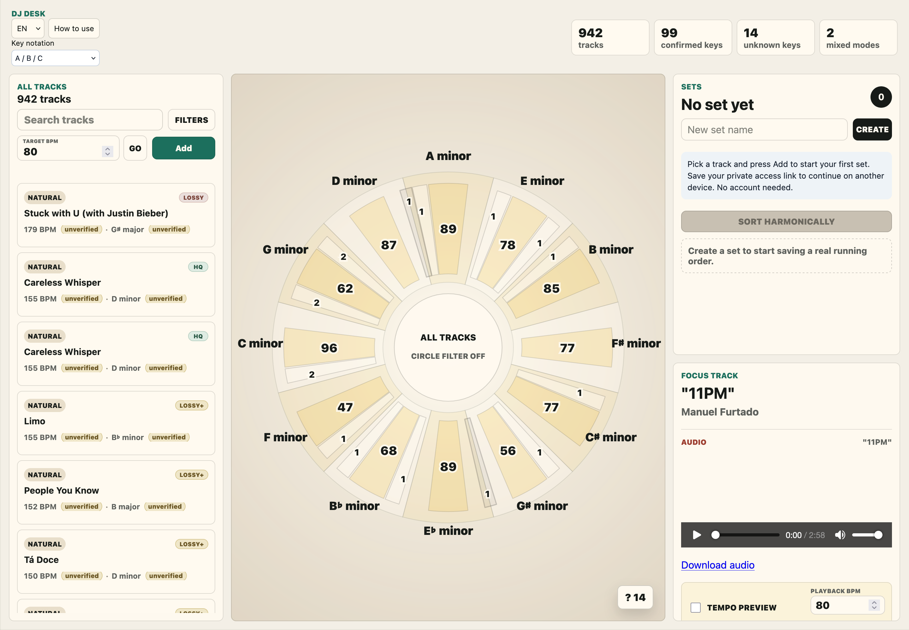
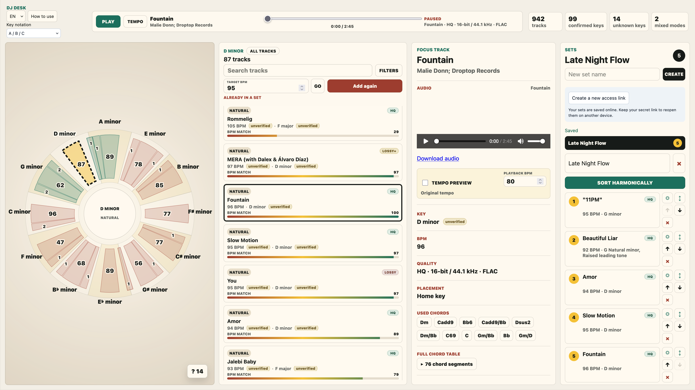
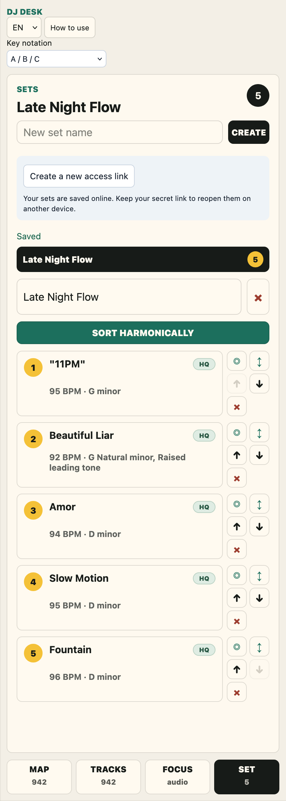

# DJ Desk

A harmonic DJ set planner with a modal circle of fifths, BPM matching, audio preview,
and private saved sets. Built for planning Brazilian zouk and other music journeys.

**[Try the live demo](https://djdesk.zouk-in-tomsk.ru)** ·
[Run locally](#quick-start) · [Self-host](deploy/README.md) ·
[Russian user guide](docs/user-guide.ru.md)



## Plan the next transition

- Explore a modal circle of fifths and filter the catalogue by harmonic context.
- Search by track, artist or key; narrow the results by BPM, audio availability and quality.
- Preview linked audio, seek through a recording and download available files.
- Build sets with drag-and-drop ordering, repeated tracks, replacements and harmonic sorting.
- Save multiple private sets in the public demo, then open them on another device with a secret link.
- Switch between English and Russian, and between letters, solfege, Camelot and Open Key notation.

The harmonic map helps you find candidates; your ears decide whether a transition works.



<details>
<summary>Mobile set editor</summary>



</details>

## Two ways to use it

|           | Local mode                          | Public mode                                                |
| --------- | ----------------------------------- | ---------------------------------------------------------- |
| Catalogue | Your own library and operator tools | Explicitly selected, read-only catalogue                   |
| Audio     | Link or import your files           | Only audio enabled by the operator                         |
| Sets      | Local library workflow              | Private visitor workspaces, autosave and conflict recovery |
| Access    | A trusted local environment         | HTTPS, secret workspace links and browser sessions         |

The default is **local mode**. Its administrative APIs are intended for a trusted machine
or network. The development servers listen on all interfaces by default.

The public demo has no accounts or public set pages. Keep your workspace link somewhere
safe: anyone with that link can edit your sets, and there is no account-based recovery.
Browser sessions last 30 days; replacing the link revokes previous sessions.
The [public-mode design](docs/public-demo.md) explains isolation, publication and saving.

## Quick start

Use **Node.js 24.15.0** (see `.node-version`) and **npm 11.12.1 or newer**.

```sh
git clone https://github.com/yernende/djdesk.git
cd djdesk
npm ci
SEED_SAMPLE_DATA=true npm run dev
```

Open [localhost:5173](http://localhost:5173). The API listens on
[localhost:3000](http://localhost:3000). Sample metadata is seeded only into an empty
database; no music files are included. Run `npm run dev` without the seed flag to use
an empty library or continue working with an existing one.

The server creates `data/djdesk.sqlite` and applies migrations on startup. A root `.env`
can hold local settings; existing environment variables take priority. Relative configured
directory and database paths resolve from the repository root, including when running npm
workspace scripts. Executable settings such as `FFPROBE_PATH` retain normal command/path
semantics.

| Setting                     | Default                     | Purpose                                           |
| --------------------------- | --------------------------- | ------------------------------------------------- |
| `DATABASE_PATH`             | `data/djdesk.sqlite`        | SQLite database                                   |
| `AUDIO_UPLOAD_DIR`          | `data/audio`                | Imported and uploaded audio                       |
| `WINDOWS_FLASH_STAGING_DIR` | `data/windows-flash-import` | Temporary files for the optional Windows importer |
| `DJ_TOOL_ROOT`              | `../dj`                     | Optional external retrieval tool                  |
| `CHORDAI_KIT_ROOT`          | `../chordai-pipeline-kit`   | Optional external analysis pipeline               |
| `FFPROBE_PATH`              | `ffprobe` on `PATH`         | Audio inspection executable                       |

Private data, local `.env` files and generated artifacts are ignored by Git.

## Bring your own audio

Install a working **FFprobe** (distributed with FFmpeg) for linked-file quality analysis
and public-data preparation. Set `FFPROBE_PATH` if it is not available on `PATH`.
Browsing sample metadata does not require audio tooling.

Link an existing audio folder or import complete ChordAI report directories:

```sh
npm run audio:link -- --root /absolute/path/to/music
npm run import:chordai -- --reports /absolute/path/to/reports --remove-samples
npm run audio:quality -- --dry-run --limit 10 --force
npm run audio:quality -- --force
```

Quality labels are derived from the actual linked file, not its filename or imported
metadata. Follow the [audio quality contract](docs/specs/audio-quality.md) when changing
importers or audio paths.

Rekordbox and Windows-library importers are also included. Some operator workflows
integrate with separate `dj` and ChordAI pipeline tools, external credentials or SSH
access; those tools and services are not bundled. The core planner and sample library
run independently. Configure the integration paths only when using those workflows.
Where yt-dlp is used, `--yt-dlp-path` takes priority over `YTDLP_PATH`, then `PATH`.

The code license does not grant rights to music. Only publish audio you are authorized
to make available for both streaming and download.

## Development

```sh
npm run check
npm run build
```

`check` runs TypeScript, Oxlint, Oxfmt and the test suites. CI installs FFmpeg/FFprobe,
checks the project, builds production assets and scans the full Git history for secrets.
Deployment is opt-in; see [self-hosting](deploy/README.md).

| Workspace         | Responsibility                                        |
| ----------------- | ----------------------------------------------------- |
| `apps/client`     | Vue 3, Vite and the responsive planner interface      |
| `apps/server`     | Fastify API, SQLite, audio analysis and import tools  |
| `packages/domain` | Shared musical model and harmonic planning algorithms |

The Node server runs TypeScript directly; production also needs the built domain package
and client assets. SQLite migrations run at application startup. No Docker is required.
The Russian guide is generated from the in-app help with `npm run guide:ru`.

## License

[MIT](LICENSE) © 2026 Alexander Olekhnovitch.
